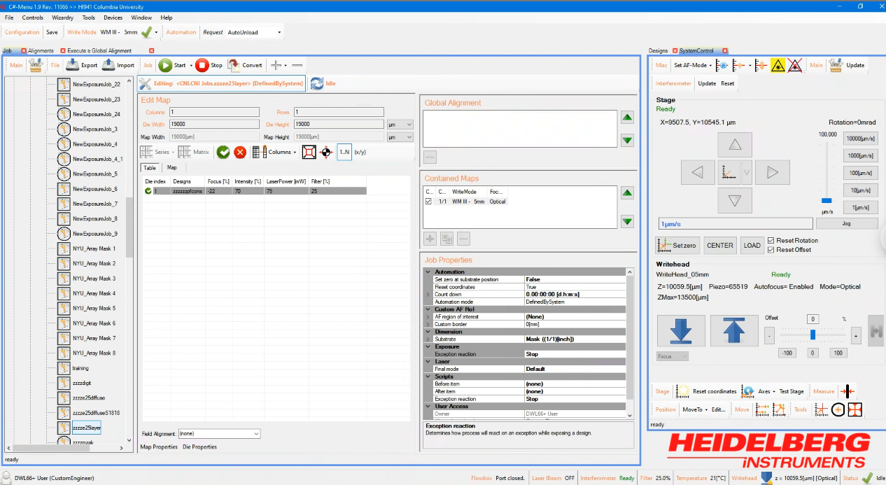

# 2026-08-14 (1,3) failed to read data from the laser metrics.

Expose finished OK but the error messed up the pixel locations so we halted. I had to manually resize all the panels. 

# 2026-08-15 (2,1) `Type: MovementException` at the end of the expose. 

Not sure - seems to happen when the laser was retracting after the write? I executed an up button and it worked fine. 

# 2026-08-15 (4,0) Could not match the OK popup after write
Evereything was OK but the popup did not have focus so the top bar was not blue. Clicking on it to bring it into focus fixed it. Probably should have the capture only be the text. 

# 2026-08-15 (4,5) same machine error again...
```
<CNI.CNI Jobs.zzzze25layer>
Start 00:10:29 --> End 00:21:46 --> Duration 00:11:16
Status: Failed

<EXCEPTION>
Type: MovementException

C#-Menu 1.9 Rev. 11066

System: HI941 Columbia University

CreationTime: 8/16/2026 12:21:46 AM

ErrorCode: 0x0

Message: 
DigitalAFCard >> Exception while movement

<Additional Data>
<Error>
Movement command <move zI -menu -d=250 
> reported error <39>: movement electr def, pos. 64381
</Error>
<MovementErrorCode>
39
</MovementErrorCode>
<DeviceIdentification>
DigitalAFCard
</DeviceIdentification>
</Additional Data>


<StackTrace>
   at HIMT.Components.WriteHeads.Digital.DigitalAutofocusCard.SendCommand(String Command, CommonDeviceAction Reference, Boolean IsMovement, Boolean IsFocusMovement, Boolean NoPositionEvents)
   at HIMT.Components.WriteHeads.Digital.DigitalAutofocusCard.InitializeStepperDelegate(CommonDeviceAction Reference)
   at HIMT.Components.Common.VoidCommandExecutionAction.ExecutionImplementation()
   at HIMT.Components.Common.CommonDeviceAction.Execute(Boolean Queued)
   at HIMT.Components.Common.CommonDeviceAction.ThrowLastException()
   at HIMT.Components.Common.BaseCDCommand.ExecuteAction(CommonDeviceAction Action, Boolean Wait4Execution, Boolean PublishException)
   at HIMT.Components.WriteHeads.Digital.DigitalWriteHead.InitializeCoordinatesImplementation(CommonDeviceAction Reference)
   at HIMT.Lithography.Systems.Components.WriteHeads.CommonWriteHead.InitializeCoordinatesDelegate(CommonDeviceAction Reference)
   at HIMT.Lithography.Systems.Components.WriteHeads.CommonWriteHead.StandByDelegate(CommonDeviceAction Reference)
   at HIMT.Components.Common.VoidCommandExecutionAction.ExecutionImplementation()
   at HIMT.Components.Common.CommonDeviceAction.Execute(Boolean Queued)
   at HIMT.Components.Common.CommonDeviceAction.ThrowLastException()
   at HIMT.Components.Common.BaseCDCommand.ExecuteAction(CommonDeviceAction Action, Boolean Wait4Execution, Boolean PublishException)
   at HIMT.Components.Common.VoidCDCommand.Execute(Int32 ExecutionTimeout, IAbortable Abortable, Boolean PublishException, eDebugLevel DebugLevel)
   at HIMT.Lithography.Systems.Components.WriteHeads.CommonWriteHead.MoveToStandByPosition(Int32 ExecutionTimeout, IAbortable Abortable)
   at HIMT.Lithography.Systems.LithographySystem.MoveWriteHeadToStandBy(IAbortable Abortable)
   at HIMT.Lithography.Systems.LithographySystem.PrepareUnload(CommonDeviceAction Reference, ILoadableJob Job, ItemLoadMode LoadMode)
   at HIMT.ProcessSystems.ProcessSystem.Unload(CommonDeviceAction Reference, ILoadableJob Job, ItemLoadMode LoadMode)
   at HIMT.ProcessSystems.Processing.ProcessItem.Process(Boolean TestAlignmentMode, CommonDeviceAction Reference, ProcessItemProcessResult Result, IContainerProcessItem Parent)
</StackTrace>
</EXCEPTION>

Logfile: C:\HIMT\LOG\Processing\2026\08(August)\zzzze25layer_2026.08.16_00.10.29.log


 <Map for <zzzze25layer>>
 Start 00:10:30 --> End 00:21:45 --> Duration 00:11:15
 Status: Processed
 
 Results for dies:
  <Die(1/1)>
  Start 00:10:30 --> End 00:21:45 --> Duration 00:11:15
  Status: Processed
  FocusOffset: -22
  LaserPower: 75[mW]
  Dose: 0[J/cm²]
  Intensity: 70
  ExposureAutofocusMode: Enabled
  
  Result(s) of design exposure(s):
   <zzzzzzpfcons>
   Start 00:10:30 --> End 00:21:45 --> Duration 00:11:15
   Status: Processed
   <Data>
   Size: (18.9999/18.9999)[mm]; Offset: (-9.49995/-9.49995)[mm]; PixelResolution: Binary; NumberOfStripes: 127; FilledStripes: 127; SpeedScale: 1; FocalLength: 5[mm]; WriteHeadString: 5mm; NOver: 1; Bidirectional: False; ScanWidth: 150000[nm]; BeamMode: 0-1-0-0
   </Data>
   <Parameter>
   ExposureCount: 1
   
   </Parameter>
   </zzzzzzpfcons>
  
  </Die(1/1)>
 
 </Map for <zzzze25layer>>

</CNI.CNI Jobs.zzzze25layer>
```

